# User Flows - Gambia Land Registry On-Chain

This document outlines the key user flows in the Gambia Land Registry On-Chain application. These flows describe the journey users take to accomplish various tasks within the application.

## Table of Contents

- [Overview](#overview)
- [User Types](#user-types)
- [Authentication Flows](#authentication-flows)
- [Property Registration Flow](#property-registration-flow)
- [Property Search Flow](#property-search-flow)
- [Document Management Flow](#document-management-flow)
- [Dashboard Interaction Flow](#dashboard-interaction-flow)
- [Mobile User Flows](#mobile-user-flows)
- [Error Handling Flows](#error-handling-flows)
- [Accessibility Considerations](#accessibility-considerations)

## Overview

The Gambia Land Registry On-Chain application provides a comprehensive set of features for land registry management. Each user flow is designed to be intuitive, efficient, and secure, focusing on the needs of citizens, government officials, and other stakeholders.

## User Types

The application serves several types of users, each with different permissions and needs:

1. **General Public**
   - Can search and view public property records
   - Limited access to property details
   - Cannot perform registry actions

2. **Registered Citizens**
   - Can register properties they own
   - Can manage their own property documents
   - Can view detailed property information for their properties
   - Can request transfers and updates

3. **Government Officials**
   - Can approve/reject property registrations
   - Can verify documents
   - Can handle disputes
   - Have access to administrative functions

4. **System Administrators**
   - Manage user accounts
   - Configure system settings
   - Monitor system health
   - Generate reports

## Authentication Flows

### 1. Registration Flow

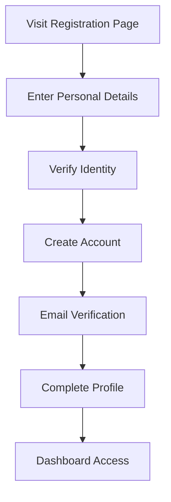

**Steps:**
1. User visits the registration page
2. User enters personal details (name, email, phone)
3. User verifies identity (ID number, passport)
4. User creates account with password
5. User receives and completes email verification
6. User completes their profile with additional information
7. User gains access to their dashboard

### 2. Login Flow

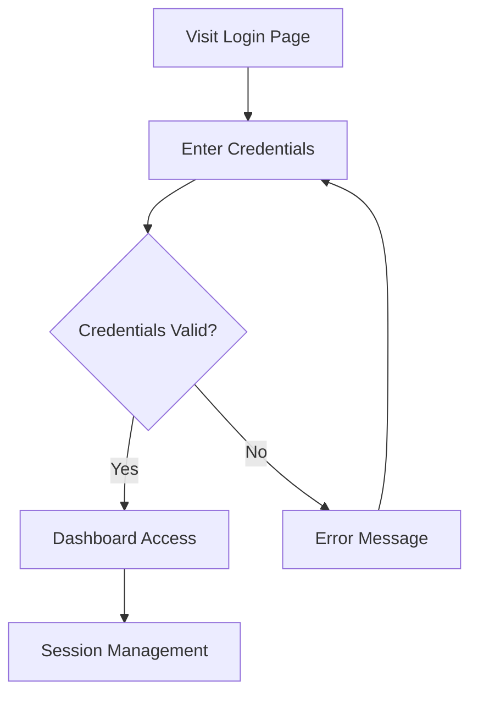

**Steps:**
1. User visits the login page
2. User enters email/username and password
3. System validates credentials
4. If valid, user is redirected to dashboard
5. If invalid, user receives appropriate error message

### 3. Password Recovery Flow

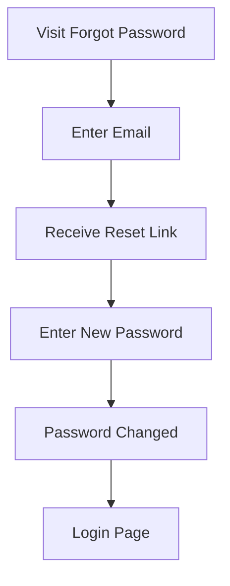

**Steps:**
1. User clicks "Forgot Password" link
2. User enters email address
3. System sends password reset link
4. User creates new password
5. User is redirected to login with new credentials

## Property Registration Flow

### 1. New Property Registration

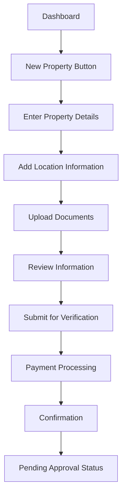

**Steps:**
1. User navigates to dashboard and clicks "Register New Property"
2. User enters basic property details (type, size, description)
3. User provides location information (coordinates, address, boundaries)
4. User uploads supporting documents (deeds, surveys, ID)
5. User reviews all entered information
6. User submits property for verification
7. User completes payment for registration fees
8. User receives confirmation of submission
9. Property status shows as "Pending Approval"

### 2. Property Transfer Flow

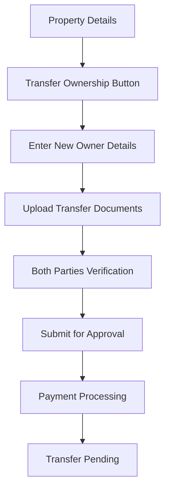

**Steps:**
1. Current owner navigates to property details
2. Owner initiates transfer process
3. Owner enters new owner details
4. Owner uploads transfer documents
5. Both current and new owner verify information
6. Submission for government approval
7. Payment of transfer fees
8. Transfer status shows as pending

## Property Search Flow

### 1. Basic Search

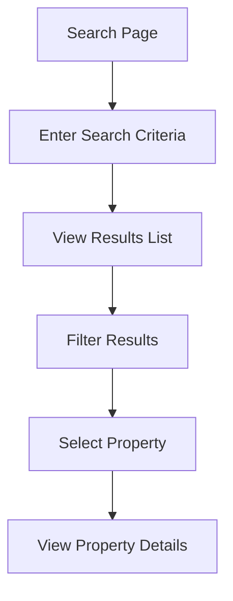

**Steps:**
1. User navigates to search page
2. User enters search criteria (location, owner name, registry number)
3. User views list of matching properties
4. User applies filters to narrow results
5. User selects a property from results
6. User views detailed property information

### 2. Map-Based Search

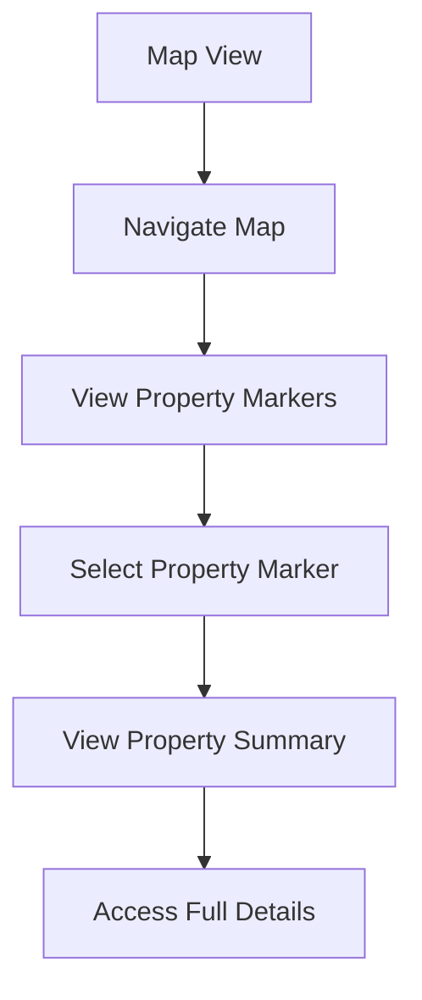

**Steps:**
1. User switches to map view
2. User navigates map to area of interest
3. User sees property markers on map
4. User selects a property marker
5. User views property summary popup
6. User clicks through to full property details

## Document Management Flow

### 1. Document Upload

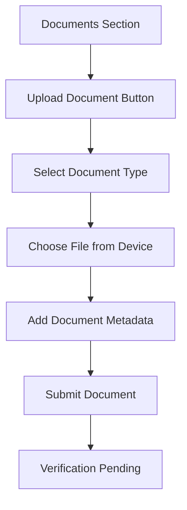

**Steps:**
1. User navigates to documents section
2. User clicks "Upload Document" button
3. User selects document type (deed, survey, tax receipt)
4. User selects file from their device
5. User adds document description and metadata
6. User submits document for verification
7. Document status shows as "Verification Pending"

### 2. Document Management

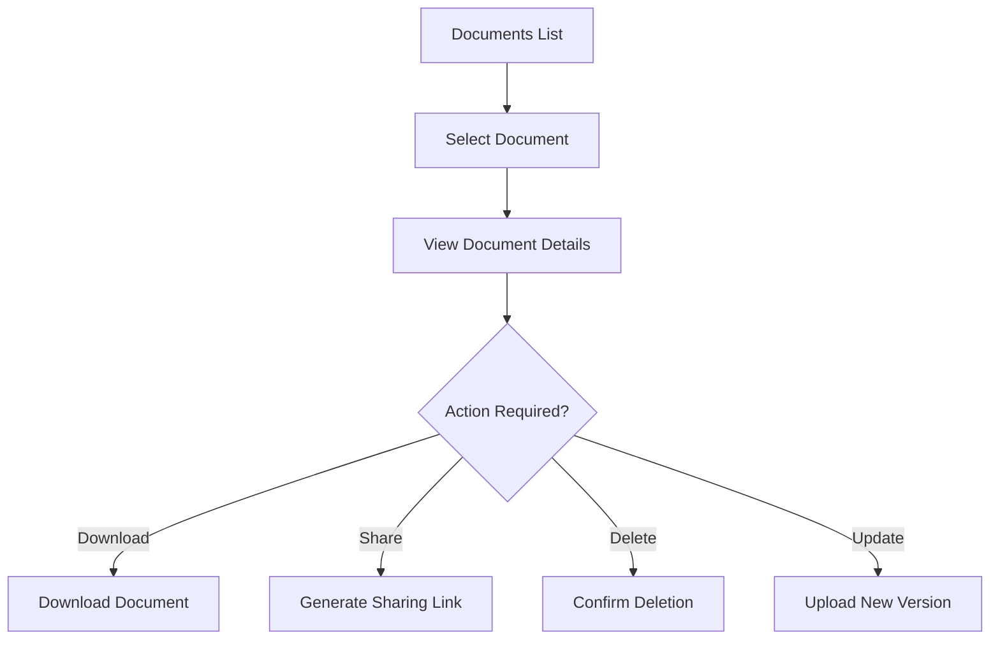

**Steps:**
1. User views list of their documents
2. User selects a document
3. User views document details and status
4. User can perform various actions:
   - Download document
   - Share document (generate secure link)
   - Request document deletion
   - Upload updated version

## Dashboard Interaction Flow

### 1. Overview Navigation

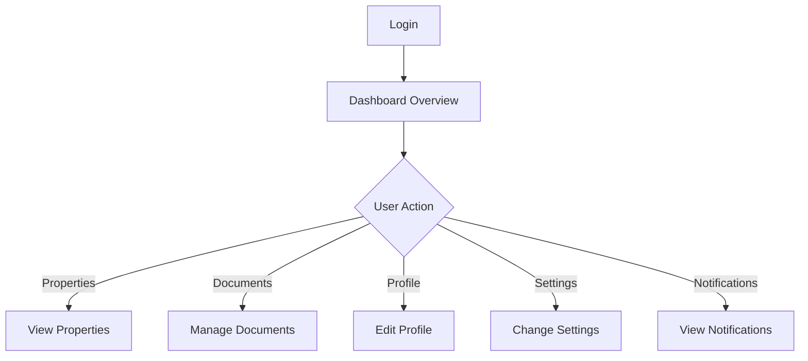

**Steps:**
1. User logs in and lands on dashboard overview
2. Dashboard displays key information and statistics
3. User navigates to different sections via sidebar or cards
4. Each section provides specialized functionality

### 2. Notification Handling

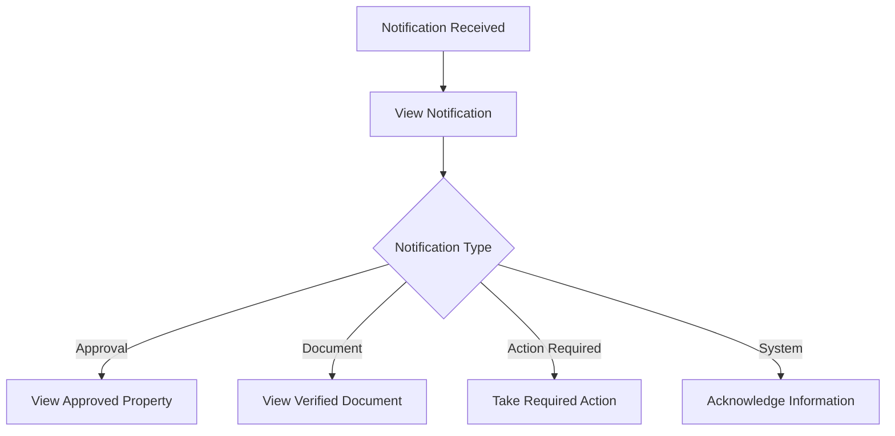

**Steps:**
1. User receives notification (in-app or email)
2. User clicks notification to view details
3. System responds based on notification type
4. User takes appropriate action or acknowledges information

## Mobile User Flows

### 1. Mobile Navigation

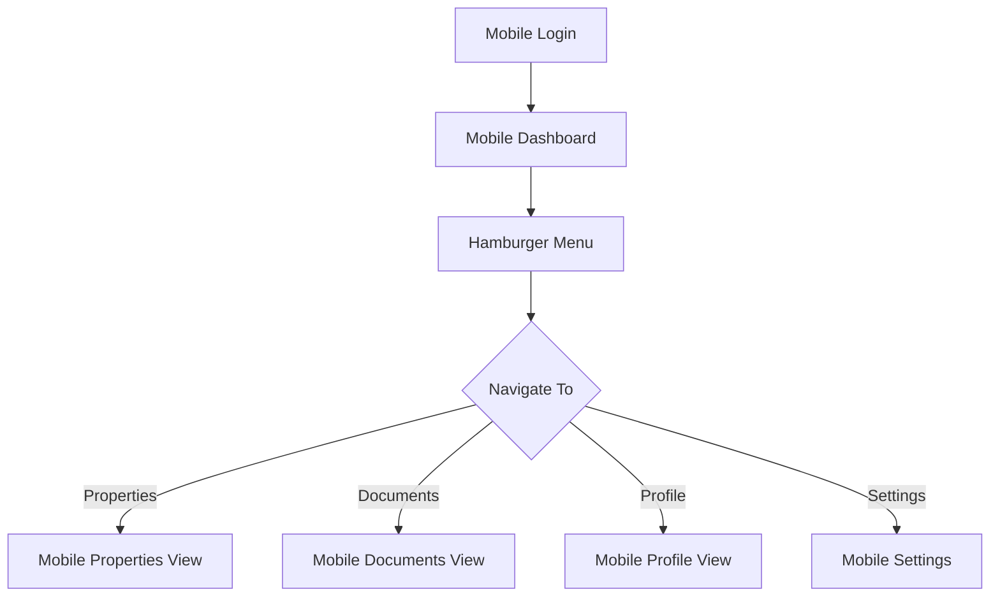

**Steps:**
1. User logs in on mobile device
2. User is presented with mobile-optimized dashboard
3. User accesses menu via hamburger icon
4. User navigates through optimized mobile views

### 2. Mobile Document Upload

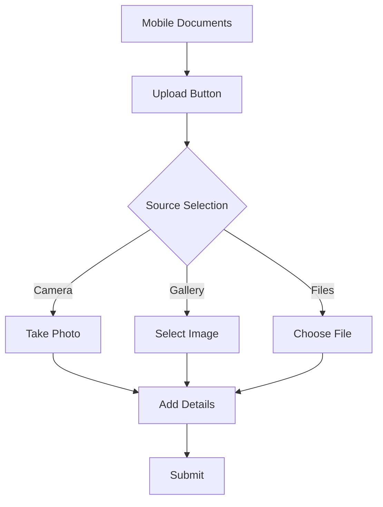

**Steps:**
1. User navigates to documents section on mobile
2. User initiates upload process
3. User chooses source (camera, gallery, files)
4. User captures or selects document
5. User adds required information
6. User submits document for verification

## Error Handling Flows

### 1. Form Validation Errors

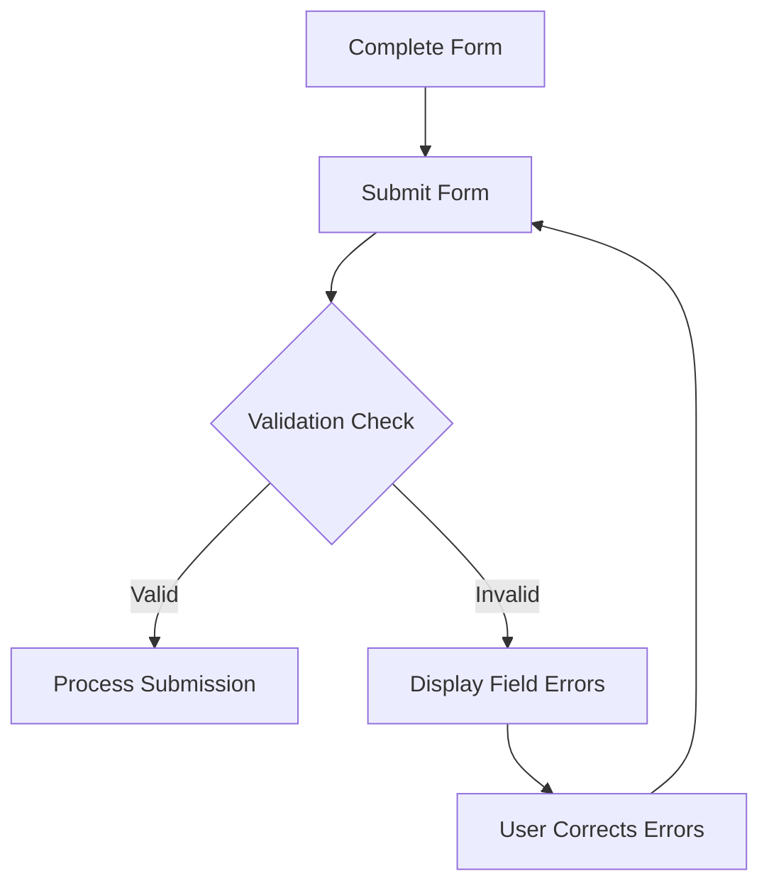

**Steps:**
1. User completes a form (registration, property details)
2. User submits the form
3. System validates input
4. If validation fails, errors are displayed next to relevant fields
5. User corrects errors and resubmits

### 2. Connection Error Handling

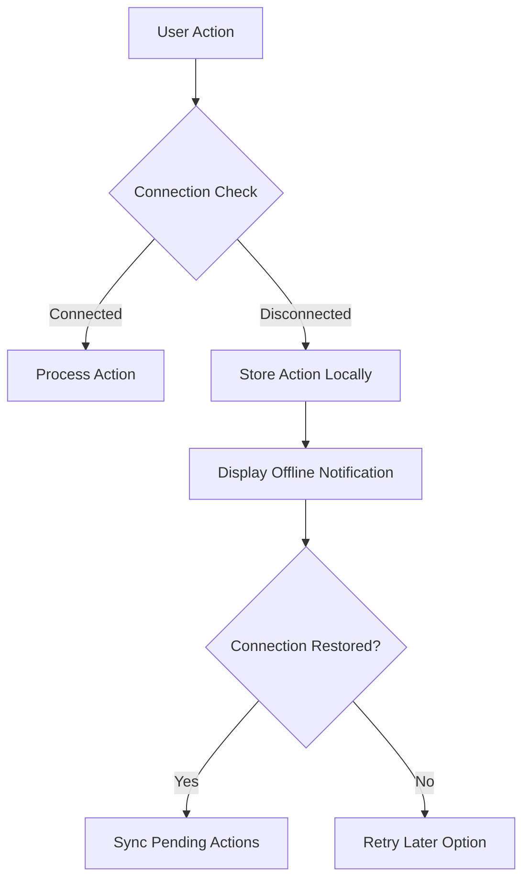

**Steps:**
1. User attempts an action requiring connectivity
2. System checks connection status
3. If offline, action is stored locally
4. User is notified of offline status
5. When connection is restored, pending actions are synchronized

## Accessibility Considerations

All user flows are designed with accessibility in mind:

1. **Keyboard Navigation**
   - All interactions can be completed using keyboard only
   - Focus indicators are clearly visible
   - Logical tab order follows visual layout

2. **Screen Reader Support**
   - All interactive elements have appropriate ARIA labels
   - Form fields include descriptive labels
   - Error messages are announced to screen reader users

3. **Color and Contrast**
   - All text meets WCAG AA contrast requirements
   - Information is not conveyed by color alone
   - High-contrast mode available

4. **Alternative Text**
   - All images have descriptive alternative text
   - Complex diagrams have detailed descriptions

5. **Time-Based Actions**
   - Users can request more time for session timeouts
   - No critical actions have short time constraints

## Conclusion

These user flows represent the core interactions within the Gambia Land Registry On-Chain application. They are designed to be intuitive, efficient, and accessible to all users, regardless of technical expertise or ability.
